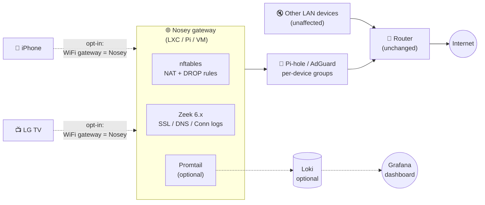
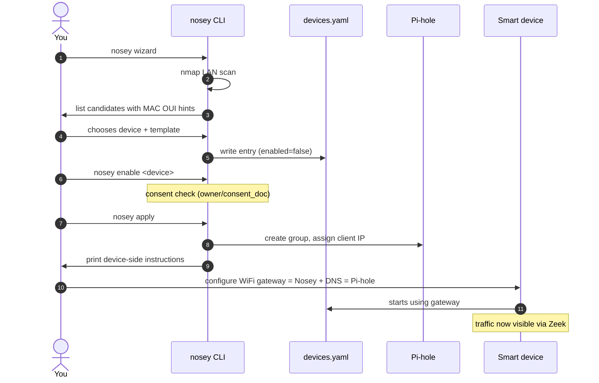

# Architecture

## High-level



## What the gateway does

1. **IP forwarding + masquerade**: traffic from devices is NAT'd out the gateway's normal upstream interface.
2. **DNS redirect**: any direct `:53` queries get DNAT'd to your Pi-hole — devices that hardcoded 8.8.8.8 still go through your blocklist.
3. **DoH/DoT drop**: traffic to `:853` and well-known DoH IPs is dropped at the gateway — devices fall back to plain DNS (which Pi-hole sees).
4. **IPv6 drop**: forward chain `ip6` policy is DROP — devices that try IPv6 are forced back to IPv4 where the gateway sees them.
5. **Zeek captures** every flow on `eth0` in JSON: `conn.log`, `ssl.log`, `dns.log`, `http.log`.

## Device opt-in flow



## Two modes

### Standalone

```yaml
observability:
  enabled: false
```

You get: device routing via gateway, Pi-hole blocking, Zeek logs on disk
(rotated daily). No dashboards. Suitable for a Raspberry Pi setup with no
other infrastructure.

### Observability

```yaml
observability:
  enabled: true
  loki_url: http://loki:3101
  grafana_url: http://grafana:3030
```

Adds: promtail shipping Zeek JSON to Loki, a templated Grafana dashboard with
per-device variable selector. Recommended only if you already run Loki/Grafana
for other things — don't deploy them just for Nosey.

## Why not just block at the router?

You can. But:

- Most home routers don't expose per-device DNS groups.
- They rarely give you packet capture (Zeek).
- You can't easily disable monitoring for one device without disrupting the network.

Nosey separates **monitoring** from **DNS resolution** from **routing**, so you
can mix and match. Want only Pi-hole blocking, no Zeek? Disable observability,
don't install Zeek. Want Zeek without DNS group splitting? Skip the apply step.

## What you DON'T need

- ❌ Custom CA / TLS interception (no MITM).
- ❌ A bypass router.
- ❌ Cloud services.
- ❌ Kubernetes.

## Performance

On a Raspberry Pi 4 with 5 monitored devices, normal household traffic:
- Zeek: ~3% CPU steady, peaks 15% when streaming.
- Promtail: ~1% CPU.
- nft: negligible.
- Disk: ~50 MB/day per device of Zeek logs (rotated weekly).

On a Proxmox LXC (2c/2 GB) running the same: idle <1%.
